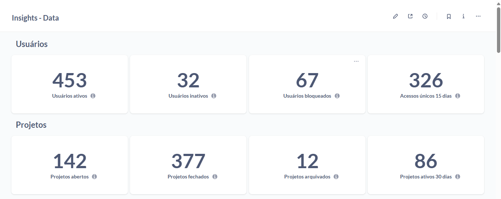
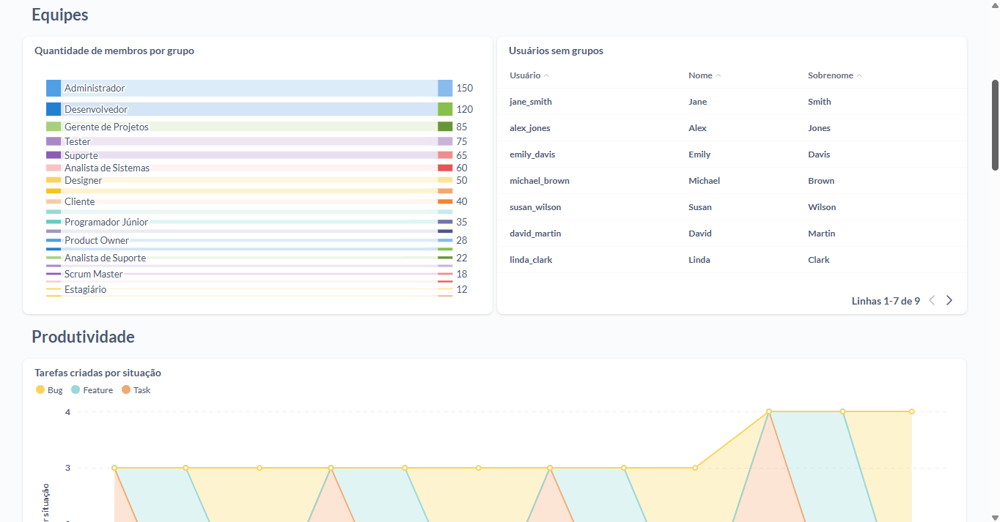
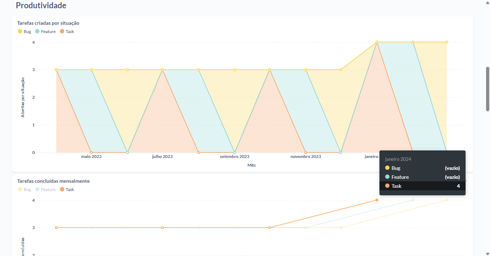
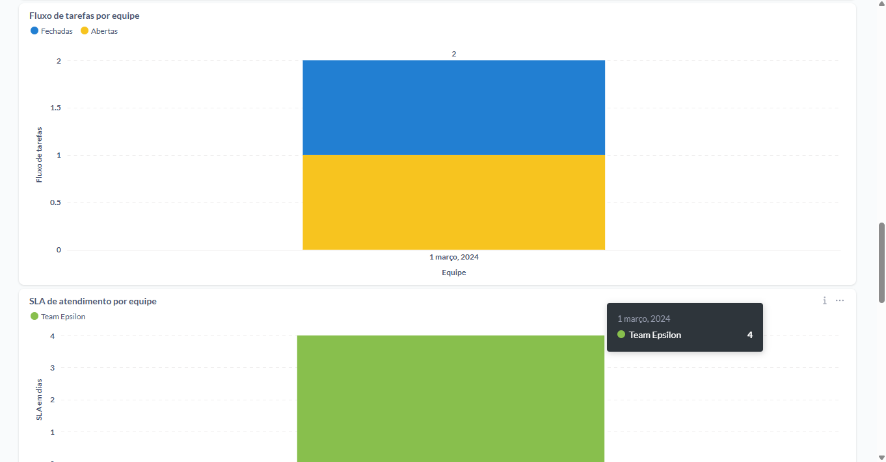
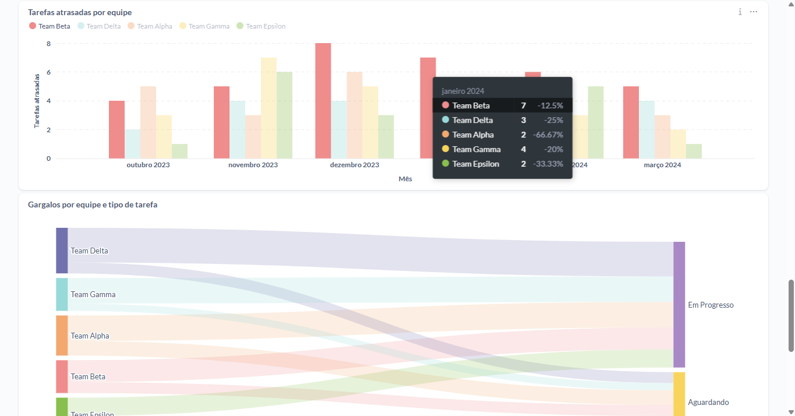
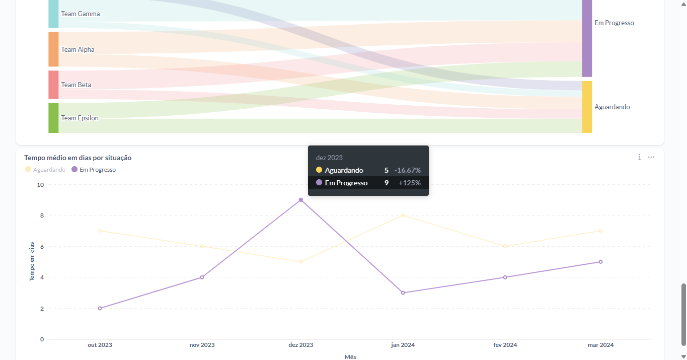

# 📊 BI Metadata Dashboard for Redmine

Welcome to the **BI Metadata Dashboard for Redmine**! 🚀 This project provides a powerful metadata visualization tool designed to help **Redmine** users and managers analyze, monitor, and optimize their data structures efficiently.

## 🔥 Key Features
- 📌 **Comprehensive Metadata Analysis**: Gain insights into your **Redmine** database structure and relationships.
- 📊 **Visual Dashboards**: User-friendly charts and tables to facilitate decision-making.
- ⚡ **Optimized Performance Monitoring**: Identify bottlenecks and improve data retrieval times.
- 🔍 **Advanced Search & Filtering**: Find relevant metadata quickly and easily.
- 🔄 **Automated Updates**: Keep your metadata up-to-date effortlessly.

## 🚀 Why Use This for Redmine?
- ✅ Designed specifically to integrate with **Redmine**'s data model.
- 📊 Helps **Redmine administrators and project managers** optimize workflows.
- 🔧 Facilitates troubleshooting and performance tuning in **Redmine** environments.

## 📂 How to Use
1. Clone this repository:
   ```bash
   git clone https://github.com/your-repo/bi-metadata-dashboard-redmine.git
   ```
2. Navigate to the project directory:
   ```bash
   cd bi-metadata-dashboard-redmine
   ```
3. Follow the setup instructions in the `INSTALL.md` file.
4. Start analyzing your **Redmine** metadata effortlessly!

## 🎯 Target Audience
This tool is ideal for:
- **Redmine administrators** looking to optimize performance.
- **Project managers** seeking data-driven insights for better decision-making.
- **BI analysts** who need structured metadata views for reporting.

## 📸 Dashboard Preview








## 💰 Pricing & Access
To use this dashboard, please contact **contato@redmineresolve.com.br** to request a quote.

## 🤝 Contributing
We welcome contributions! Feel free to fork this repository, open issues, and submit pull requests to enhance the **Redmine** metadata experience.

## 📜 License
This project is open-source and available under the [MIT License](LICENSE).

---
Elevate your **Redmine** metadata management with our BI dashboard today! 🌟

